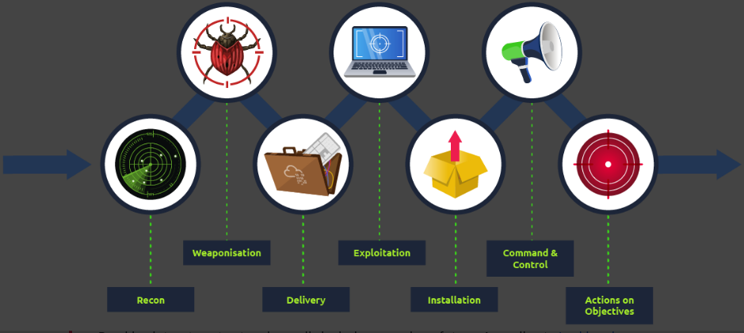

Network Security
========================

## Introduction

Computer network is a group of computers and devices connected with each other

Network security focuses on protecting the security of these devices and the links connecting them.

Network security consists of different hardware and software solutions to achieve the set security goals. Hardware solutions refer to the devices you set up in your network to protect your network security

- Firewall -> allows and blocks connections based n a predefined set of rules.  It restricts what can enter and what can leave a network
- Intrusion Detection System (IDS) appliance: detects system and network intrusions and intrusion attempts. it tried to detect attackers attempt to break into your network
- Intrusion prevention System (IPS): blocks detected intrusions and intrusion attempts. It aims to prevent attackers from breaking into your network
- Virtual Private Network(VPN): ensures that the network traffic cannot be read nor altered by a third party. It protects the confidentiality and integrity of the sent data

Software Security Solutions:
- Antivirus software
- Host firewall: a program that ships as part of your system, or it is a program that you install on your system. For instance, MS Windows includes windows defender firewall, Apple macOS includes an application firewall, both are host firewalls

## Methodology

Breaking into a target network usually includes a number of steps:
1. Recon(reconnaissance): refers to step where attacker tries to learn as much as possible about the target.
2. Weaponization: Refers to preparing a file with a malicious component, for example to provide the attacker with remote access
3. Delivery: delivering the "weaponized" file to the target via any feasible method, such as email or USB flash memory
4. Exploitation: When the user opens the malicious file, their system executes the malicious component
5. Installation: the previous step should install malware on the target system
6. Command & Control: successful installation of malware provides the attacker with a command and control ability over the target system
7. Actions on Objectives: after gaining control over the target system, the attacker has achieved their objectives. 

## Hands On
[file](../THM_HandsOn/Network Security - Beginner - Network Security v3.md)