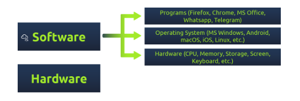
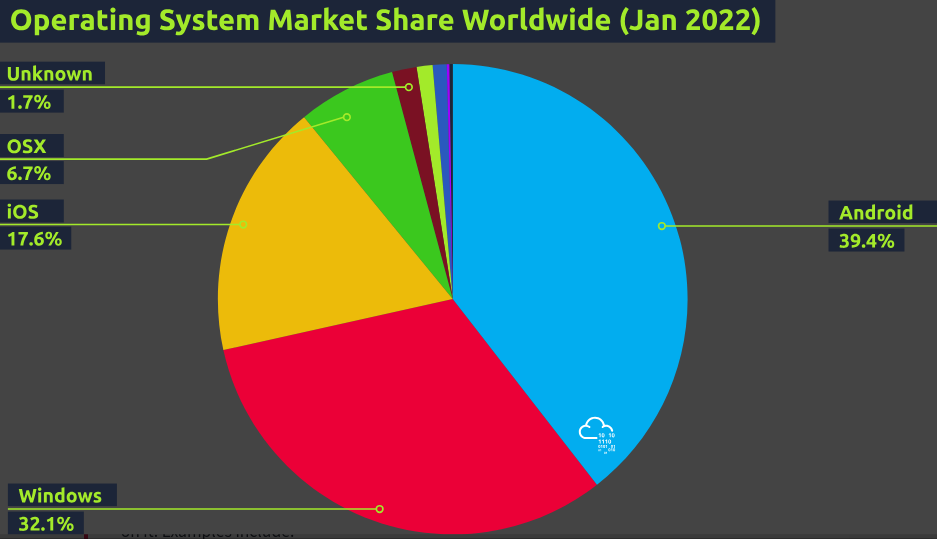
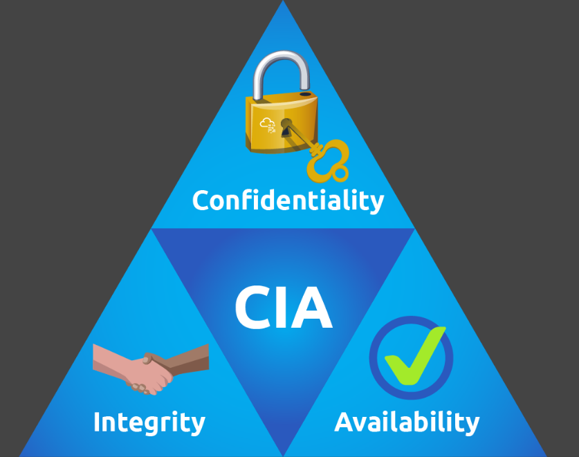

Operating System Security
========================

## Introduction to Operating System Security

Operating systems include MS windows, macOS, iOS, Android, Chrome OS, Linux

Computer hardware refers to all the computer parts and peripherals that you can touch with your hand. Hardware includes the screen, keyboard, printer and USB flash memory, desktop board

Hardware components by themselves are useless if you want to run programs and applications, we need an operating system to control and drive them

The operating system (OS) is the layer sitting between the hardware and the applications and programs user is running.
All programs and applications cannot run directly on the computer hardware, however, they run on top of the operating system. The operating system allows these programs to access the hardware according to specific rules.

When we talk about security, we should think of protecting three things:
1. Confidentiality - ensure that secret and private files and information are only available to intended persons
2. Integrity - it is crucial that non one can tamper with the files stored on your system or while being transferred on the network
3. Availability - system to be available to use anytime you decide to use it.

## Common Examples of OS Security

Security is concerned with attacks against:
- Confidentiality
- Integrity
- Availability

### Authentication and Weak Passwords
> Authentication is the act of verifying your identity, be it a local or a remote system

It can be achieved via three main ways:
1. Something you know, such as password/PIN code
2. Something you are, such as fingerprint
3. Something you have, such as a phone number via which you can receive an SMS message for verification

Weak passwords are easily guessed based on patterns and commonly found passwords that are found in data breaches, better to use complex passwords and store them separately and use different passwords for different accounts

### Weak File Permissions

Proper security dictates the _principle of least privilege_. In an environment, you want any file accessible only by those who need to access it to get work done.

Weak file permissions make it easy for the adversary to attack confidentiality and integrity. They can attack confidentiality as weak permissions allow them to access files they should not be able to access.

### Malicious Programs

Depending on the type of malicious program, it can attack confidentiality, integrity and availability.

Some types of malicious programs, such as Torjan horses, give the attacker access to your system. Consequently the attacker would be able to read your files or even modify them

Some types of malicious programs attack availability. One such example is ransomware.

## Hands On
[file](../THM_HandsOn/OS Security - Beginner - OS Security v1.md)