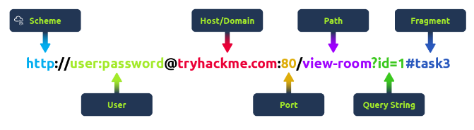
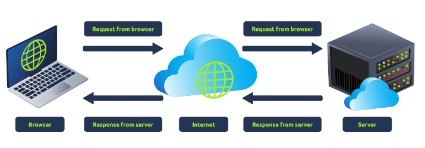

How The Web Works
========================

# DNS in detail
It provides a simple way for us to communicate with devices on the internet without remembering complex numbers.


## Domain Hierarchy

### TLD - Top Level Domain
It is the most right-hand part of the domain name. 

There are two type of TLD, gTLD(Generic TLD) and ccTLD(Country Code TLD)

### Second Level Domain
Taking coachbeardjr.vercel.com as an example, the .com part is the TLD, and vercel is the Second Level Domain. When registering a domain name, the second-level domain is limited to 63 characters + the TLD and can only use a-z 0-9 and hyphens (cannot start or end with hyphens or have consecutive hyphens).

### Subdomain
A subdomain sits on the left-hand side of the Second-Level Domain using a period to separate it; for example, in the name coachbeardjr.vercel.com the coachbeardjr part is the subdomain. A subdomain name has the same creation restrictions as a Second-Level Domain, being limited to 63 characters and can only use a-z 0-9 and hyphens (cannot start or end with hyphens or have consecutive hyphens). You can use multiple subdomains split with periods to create longer names, such as jupiter.servers.tryhackme.com. But the length must be kept to 253 characters or less. There is no limit to the number of subdomains you can create for your domain name.


## DNS Record Types
DNS isn't just for websites though, and multiple types of DNS record exist.

### A Record
These records resolve to IPv4 addresses, for example 104.26.10.229

### AAAA Record
These records resolve to IPv6 addresses, for example 2606:4700:20::681a:be5

### CNAME Record
These records resolve to another domain name, for example, TryHackMe's online shop has the subdomain name store.tryhackme.com which returns a CNAME record shops.shopify.com. Another DNS request would then be made to shops.shopify.com to work out the IP address.

### MX Record
These records resolve to the address of the servers that handle the email for the domain you are querying, for example an MX record response for tryhackme.com would look something like alt1.aspmx.l.google.com. These records also come with a priority flag. This tells the client in which order to try the servers, this is perfect for if the main server goes down and email needs to be sent to a backup server.

### TXT Recird
TXT records are free text fields where any text-based data can be stored. TXT records have multiple uses, but some common ones can be to list servers that have the authority to send an email on behalf of the domain (this can help in the battle against spam and spoofed email). They can also be used to verify ownership of the domain name when signing up for third party services.

## Making DNS Request
1. When you request a domain name, your computer checks its local cache first to see if you previously looked up the address recently. If not a request to your Recursive DNS server will be made.
2. Recursive DNS Server is usually provided by your ISP, you can configure to something else if needed. This server also has local cache. If the request cannot be found locally, a journey begins to find the correct answer, starting with the internet's root DNS servers.
3. The Root servers act as DNS backbone of internet, their job is to redirect you to the correct top level domain server, depending on your request.
4. TLD server holds record for where to find the authoritative server to answer the DNS request. The authoritative server is often also known as the nameserver for the domain.
5. An authoritative DNS server is the server that is responsible for storing the DNS records for a particular domain name and where any updates to your domain name DNS records would be made. Depending on the record type, the DNS record is then sent back to the Recursive DNS Server, where a local copy will be cached for future requests and then relayed back to the original client that made the request. DNS records all come with a TTL (Time To Live) value. This value is a number represented in seconds that the response should be saved for locally until you have to look it up again. Caching saves on having to make a DNS request every time you communicate with a server.


# HTTP in detail

## What is HTTP(S)
HTTP is the set of rules used for communicating with web servers for the transmitting of webpage data, whether that is HTML, images, audio etc...

HTTPS is secure version of HTTP


## Requests and Responses
URL is predominantly an instruction on how to access a resource on the internet



Scheme: This instructs on what protocol to use for accessing the resource such as HTTP, HTTPS, FTP (File Transfer Protocol).

User: Some services require authentication to log in, you can put a username and password into the URL to log in.

Host: The domain name or IP address of the server you wish to access.

Port: The Port that you are going to connect to

Path: The file name or location of the resource you are trying to access.

Query String: Extra bits of information that can be sent to the requested path. For example, /blog?id=1 would tell the blog path that you wish to receive the blog article with the id of 1.

Fragment: This is a reference to a location on the actual page requested. This is commonly used for pages with long content and can have a certain part of the page directly linked to it, so it is viewable to the user as soon as they access the page.

## HTTP Methods
1. GET
2. POST
3. PUT
4. DELETE


## HTTP Status Codes
100- 199 -> Information Response
200 - 299 -> Success
300 - 399 -> Redirection
400 - 499 -> Client Errors
500 - 599 -> Server Errors

200 -> OK
201 -> Created
301 -> Moved Permanently
302 -> Found
400 -> Bad Request
401 -> Not Authorised
403 -> Forbidden
404 -> Page Not Found
405 -> Method not allowed
500 -> Internal Service Error
503 -> Service Unavailable


## Headers
Headers are additional bits of data you can send to web server when making requests

Common Request Headers

These are headers that are sent from the client (usually your browser) to the server.

**Host**: Some web servers host multiple websites so by providing the host headers you can tell it which one you require, otherwise you'll just receive the default website for the server.

**User-Agent**: This is your browser software and version number, telling the web server your browser software helps it format the website properly for your browser and also some elements of HTML, JavaScript and CSS are only available in certain browsers.

**Content-Length**: When sending data to a web server such as in a form, the content length tells the web server how much data to expect in the web request. This way the server can ensure it isn't missing any data.

**Accept-Encoding**: Tells the web server what types of compression methods the browser supports so the data can be made smaller for transmitting over the internet.


**Cookie**: Data sent to the server to help remember your information (see cookies task for more information).
Common Response Headers

These are the headers that are returned to the client from the server after a request.

**Set-Cookie:** Information to store which gets sent back to the web server on each request (see cookies task for more information).

**Cache-Control**: How long to store the content of the response in the browser's cache before it requests it again.

**Content-Type**: This tells the client what type of data is being returned, i.e., HTML, CSS, JavaScript, Images, PDF, Video, etc. Using the content-type header the browser then knows how to process the data.

**Content-Encoding**: What method has been used to compress the data to make it smaller when sending it over the internet.


## Cookies
Cookies are saved when you receive a "Set-Cookie" header from a web server.

Because HTTP is stateless (doesn't keep track of your previous requests), cookies can be used to remind the web server who you are


# How Websites Work

When you visit a  website, your browser makes a request to a web server asking for information about the page you are visiting. Web server will respond with data that your browser uses to show you the page.



There are two major components that make up a website:
1. Front-end (Client Site)
2. Back-end (Server side)

## HTML

Websites are primarily created using:
- HTML, to build websites and define their structures
- CSS, to make websites look pretty by adding styling options
- JavaScript, implement complex features on pages using interactivity

Elements(or tags) are building blocks of HTML and tells browser how to display content.

```html
<html>
    <head>
        <title>Hi MOM</title>
    </head>
    <body>
        <h2>Learning</h2>
        <p>Oscar Piastri's calmness is nice trait</p>
    </body>
</html>
```

You can view HTML of any website by right-clicking and selecting "View Page Source" option


## JavaScript
JS can dynamically update the page in real time giving functionality to change the style of a button when particular event on the page occurs

JavaScript is added within the page source code and can be either loaded within <code>\<script></code> tags or can be included remotely with the src attribute such as <code>\<script src='filePath'>\</script></code>

## HTML Injection
HTML Injection is a vulnerability that occurs when unfiltered user input is displayed on the page. If a website fails to sanitise user input and that input is used to the page, an attacker can inject HTML code into a vulnerable website.


# Putting it all together

## Load Balancers
When a website traffic starts getting quite larger or is running an application that needs to have high availability, one web server might no longer do the job.

Load balancers provide two main features, ensuring high traffic websites can handle the load and providing a failover if a server becomes unresponsive

Load balancer uses different algorithms to help it decide which server is best to deal with the request.

Load balancer can also perform periodic health checks on each server to ensure they are running correctly this is called health check. If a server doesn't respond appropriately or doesn't respond, the load balancer will stop sending traffic until it responds appropriately again.

## CDN - Content Delivery Networks
CDN can be excellent resource for cutting down traffic to a busy website. It allows you to host a static files from your website such as JS, CSS, images, etcc. and host them across thousands of servers all over the world. When a user requests one of the hosted files, the CDN works out where the nearest server is physically located and sends the request there instead of potentially the other side of the world.


## Databases
Web servers can communicate with databases to store and recall data from them. Databases can range from just plain text to complex clusters of multiple servers providing speed and resilience.


## Web Application Firewall (WAF)

This sits between your web request and the web server, its primary purpose is to protect the webserver from hacking or DDoS attacks. 

It analyses the web requests for common attack techniques, whether the request is from a real browser rather than a bot. It also checks if an excessive amount of web requests are being sent by utilising something called rate limiting, which will only allow a certain amount of requests from an IP per second. 

If a request is deemed a potential attack, it will be dropped and never sent to the webserver.


## How Web Servers work

Web server is a software that listens for incoming connections and then utilises the HTTP protocol to deliver web content to its clients. A web server delivers files from whats called its root directory, which is configured in software settings.

### Virtual Hosts
Web servers can host multiple websites with different domain names, to achieve this, they use virtual host.

The web server software checks the hostname being requested from the HTTP headers and matches that against its virtual hosts(these are just text config files). If no match is found, the default website will be provided instead.

There's no limit to the number of different websites you can host on a web server.

### Static vs Dynamic Content
Static Content, is the content that never changes.

Dynamic content is content that could change with different requests.
