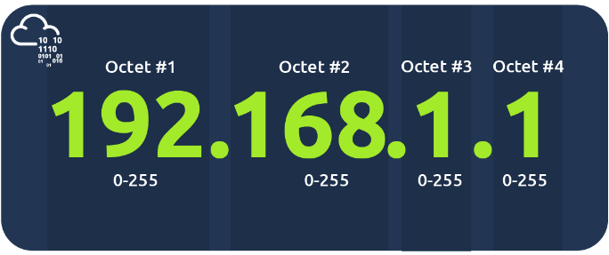
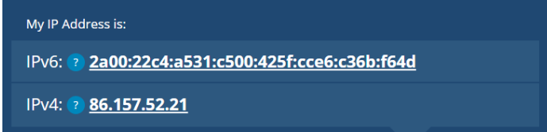
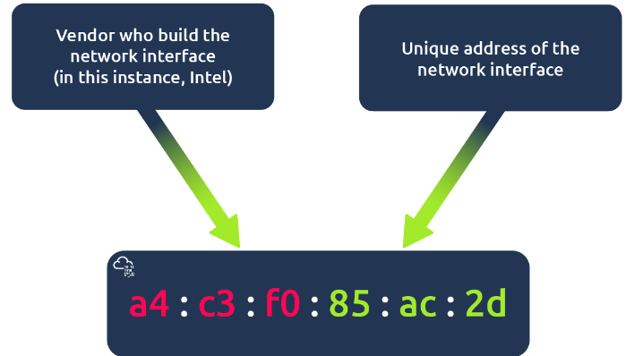
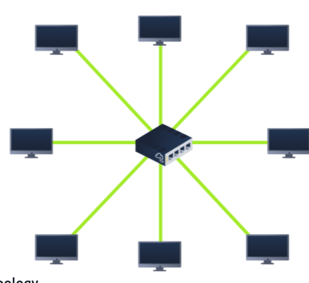
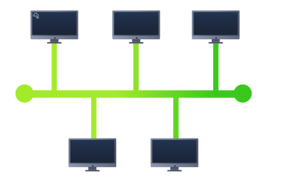
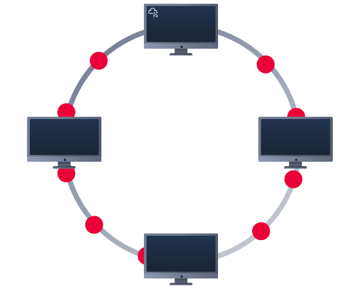

Network Fundamentals
========================

Learn the core concepts of how computers communicate with each other and types of network weaknesses

## What is Networking
*Networks are simply things connected.*

### What is the Internet?
Internet is one giant network that consists of many, many small networks within itself. These small networks are called *private networks*, where networks connecting these small networks are called *public networks* or the internet.

First iteration of the internet was within the ARPANET project in the late 1960s. This project was funded by the United Stated Defence Department and was the first documented network in action.

However, it wasn't until 1989 when the internet as we know it was invented by Tim Berners-Lee by the creation of the World Wide Web. It wasn't until this point that the internet started to be used as a repository for storing and sharing information, just like it is today.

### Identifying Devices on a Network
To communicate and maintain order, devices must be both identifying and identifiable on a network.

Devices have to means of identification with one being permeable:
1. IP address
2. A Media Access Control (MAC) address

#### IP Address

An IP address is a set of numbers that are divided into four octets. The value of each octet will summarise to be IP address of the device on the network. This number is calculated through a technique known as *IP addressing* and *subnetting*.

IP addresses follow a set of standards known as *protocols*. Devices can be on both a private and public network, depending on where they are will determine what type of IP address they have, public or private IP address.

Public address is used to identify devices on the internet.
Private address is used to identify device amongst other devices.

The above image depicts the IPv4 version of IP address, which is limited to only 2^32 IP address (4.29 billion)

IPv6 is a new iteration of the IP addressing scheme to help tackle this issue.
This supports up to 2^128 of IP addresses (340 trillion+)

#### MAC Address
Devices on a network will all have a physical network interface, which is a microchip board found on the device motherboard. This network interface is assigned a unique address at the factory it was built at called MAC address. 

The MAC address is a 12-character hexadecimal number split into two's and separated by a colon. Ex: a4:c3:aa:55:ac:2d

This MAC address can be faked or spoofed in a process called *spoofing*

This spoofing occurs when a networked device pretends to identify as another using its MAC address.

### PING (ICMP)

Ping uses ICMP(Internet Control Message Protocol) packets to determine the performance of a connection between devices, for example if the connection exists or is reliable

Pings can be performed against devices on a network, such as your home network or resources like websites.

## Intro to LAN

LAN topologies

### Star Topology
Devices are individually connected via a central networking device such as a switch or hub. This topology is the most commonly found today because of its reliability and scalability - despite the cost.
Any information sent to a device in this topology is sent via the central device to which it connects.

Because more cabling and the purchase of dedicated networking equipment is required for this topology, it is more expensive than any other topologies. This topology is much more scalable in nature, which means that it is very easy to add more devices as the demand for the network increases.

### Bus Topology
This type of connection relies upon a single connection which is known as backbone cable.

All data destined for each device travels along the same cable, it is very quickly prone to becoming slow and bottlenecked if devices within the topology are simultaneously requesting data which in turn make difficult for troubleshooting problems

Bus topologies are one of the easier and more cost efficient topologies to set up because of their expenses such as cabling or dedicated equipment used to connect these devices.

### Ring Topology
Also known as token topology, devices are connected directly to each other to form a loop which means little cabling required and less dependence on dedicated hardware such as within a star topology

A ring topology works by sending data across the loop until it reaches the destined device, using other devices along the loop to forward data. 
If a device happens to have data to send, it will send its own data first before sending data from another device

Because there is only one direction for data to travel across this topology, it is fairly easy to troubleshoot any faults that arise.

### Switch
Switches are dedicated devices within a network that are designed to aggregate multiple other devices such as computers, printers or any other networking-capable device using ethernet.

Switches are much more efficient than their lesser counterpart(hubs/repeaters). Switchers keep track of what device is connected to which port. This way, when they receive a packet, instead of repeating that packet to every port like a hub would do, it just sends it to the intended target, thus reducing network traffic

Both Switches and Routers can be connected to one another. The ability to do this increases the redundancy (the reliability) of a network by adding multiple paths for data to take. If one path goes down, another can be used. Whilst this may reduce the overall performance of a network because packets have to take longer to travel, there is no downtime -- a small price to pay considering the alternative.

### Router
Its a router's job to connect networks and pass data between them. 
Routing is the label given to the process of data travelling across networks. Routing involves creating a path between networks so that this data can be successfully delivered.

### Subnetting
Subnetting is the term given to splitting up a network into smaller, miniature networks within itself.

Network admins use subnetting to categorise and assign specific parts of a network.
Subnetting is achieved by splitting up the number of hosts that can fit within the network, represented by a number called a subnet mask.

The subnet mask is represented by 4 bytes (32 bits) ranging from 0 to 255

Subnets use IP address in 3 different ways:
1. Identify the network address
2. Identify the host address
3. Identify the default gateway

| Type | Purpose | Explanation | Example |
| - | - | - | - |
| Network Address | This address identifies the start of the actual network and is used to identify a network's existence.| For example, a device with the IP address of 192.168.1.100 will be on the network identified by 192.168.1.0| 192.168.1.0|
| Host Address | An IP address here is used to identify a device on the subnet| For example, a device will have the network address of 192.168.1.1| 192.168.1.100 |
| Default Gateway | The default gateway address is a special address assigned to a device on the network that is capable of sending information to another network |Any data that needs to go to a device that isn't on the same network (i.e. isn't on 192.168.1.0) will be sent to this device. These devices can use any host address but usually use either the first or last host address in a network (.1 or .254) | 192.168.1.254 |

### ARP Protocol
ARP (Address Resolution Protocol) allows a device to associate its MAC address with an IP address on the network. Each device on a network will keep a log of the MAC addresses associated with other devices.

When devices wish to communicate with another, they will send a broadcast to the entire network searching for the specific device. Devices can use the ARP to find the MAC address of a device for communication

#### How does ARP Work?
In each devices cache, ARP protocol stores the information of other devices on the network.

In order to map these two identifiers, the protocol sends two types of messages
1. ARP Request
    - message is broadcasted to every other device found on a network by the device, asking whether or not the device MAC address matches the requested IP address
2. ARP Reply
    - If the device does have the requested IP address, an ARP reply is returned to the initial device to acknowledge this. The initial device will now remember this and store it within its cache

### DHCP Protocol
When a device connects to a network, if it has not already been manually assigned an IP address, it sends out a request (DHCP Discover) to see if any DHCP servers are on the network. The DHCP server then replies back with an IP address the device could use (DHCP Offer). The device then sends a reply confirming it wants the offered IP Address (DHCP Request), and then lastly, the DHCP server sends a reply acknowledging this has been completed, and the device can start using the IP Address (DHCP ACK).

## OSI model
> [OSI Model](./OSI Model.md)

## Packets and Frames

Packets and frames are small pieces of data that, when forming together, make a larger piece of information or message.

A frame is at layer 2 (data link layer), meaning there is no such information about IP addresses

When the encapsulating information is stripped away, we are talking about the frame itself.

Packets are an efficient way of communicating data across network devices. Because this data is exchanged in small pieces, there is less chance of bottlenecking occurring across a network than large messages being sent at once.

Packets have different structures that are dependant upon the type of packet that is being sent.

A packet using IP protocol will have a set of headers that contain additional pieces of information to the data that is being sent across a network
1. Time to Live - This field sets an expiry timer for the packet to not clog up your network if it never manages to reach a host or escape
2. Checksum - This field provides integrity checking for protocols such as TCP/IP. If any data is changed, this value will be different from what was expected and therefore corrupt
3. Source Address - The IP address of the device that the packet is being sent from so that data knows where to return to
4. Destination Address - The device's IP address the packet is being sent to so that data knows where to travel next

Packets - contain IP addressing information
Frame - does not contain IP addressing information

### TCP/IP - Three-Way Handshake

TCP/IP protocol consists of four layers and is arguably just a summarised version of OSI model.
1. Application
2. Transport
3. Internet
4. Network Interface

One defining feature of TCP is that it is connection-based, which means that TCP must establish connection between both a client and a device acting as a server before data is sent. Because of this, TCP guarantees that any data sent will be received on the other end. This process is called *Three way handshake*

TCP packets contain various sections of information known as headers that are added from encapsulation.
| Header | Description |
| - | - |
| Source Port | Port opened by sender. This value is chosen randomly that arent currently in use |
| Destination port | port number that service is running on a remote host, this is not chosen at random |
| Source IP | IP address of device that is sending data |
| Destination IP | IP address of receiver |
| Sequence Number | When a connection occurs, the first piece of data transmitted is given a random number |
| Acknowledgement Number | after a piece of data has been a sequence number, the number for the next piece of data will have the sequence num +1 |
| Checksum | This value is what gives TCP integrity. Math calculation is made where the output is remembered. When the receiving device performs the math calculation, the data must be corrupt if the output is different from what was sent |
| Data | This header is where the data is being transmitted |
| Flag | This header determines how the packet should be handled by either device during the handshake process. Specific flags will determine specific behaviors |

Three-way handshake communicates using special messages:
1. SYN -> SYN message is the initial packet sent by client during the handshake. This packet is used to initiate a connection and synchronise the two devices together
2. SYN/ACK -> This packet is sent by the receiving device to acknowledge the sync attempt from the client
3. ACK -> The ack packet can be used by either the client or server to ack that a series of messages/packets have been successfully received
4. DATA -> once a connection has been established, data is send via "DATA" message
5. FIN -> This packet is used to cleanly close the connection after it has been complete
6. RST -> This packet abruptly ends all communication. This is the last resort and indicates there was some problem during the process. 

To initiate the closure of a TCP connection, the device will send a "FIN" packet to the other device. Of course, with TCP, the other device will also have to acknowledge this packet.

### UDP/IP
UDP is a stateless protocol that doesnt require a constant connection between the two devices for the data to be sent. That means the three-way handshake does not occur, nor is there any sync between two devices

No acknowledgement is sent during a connection

UDP packet headers
1. Time to Live -> This field sets an expiry time for the packet
2. Source Address -> ip address of the sender device
3. Destination Address -> ip address of receiver device
4. Source port -> port opened for communication in source device
5. Destination port -> port opened for communication in destination device
6. Data -> this header is where data is being transmitted is stored.

FTP -> port 21 -> used by file sharing application build on a client server model.
SSH -> port 22 -> used to secure login to system via text based interface for management
HTTP -> port 80 -> protocol powers WWW
HTTPS -> port 443 -> does the same as HTTP but uses encryption
SMB -> port 445 -> similar to FTP, but allows you to share devices like printers
RDP -> port 3389 -> secure means of logging in to a system using a virtual desktop interface

## Extending your Network

### Introduction to Port Forwarding
Port forwarding is an essential component in connecting applications and services to the internet. Without port forwarding, applications and services such as web servers are only available to devices within the same direct network.

### Firewall 101
A firewall is a device within a network responsible for determining what traffic is allowed to enter and exit.

Firewalls can be categorized into 2-5 categories
1. Stateful
    - This type of firewall uses the entire information from a connection, rather than inspecting an individual packet. If a connection from a host is bad, it will block the entire device.
2. Stateless
    - uses a static set of rules to determine whether or not individual packets are acceptable or not.
    - these firewalls are great when receiving large amounts of traffic from a set of hosts (such as a Distributed Denial-of-Service attack)

### Virtual Private Network (VPN) Basics
VPN is a technology that allows devices on separate networks to communicate securely by creating a dedicated path between each other over the internet known as tunnel. Devices connected within this runnel form their own private network

Benefits of VPN
1. Allows networks in different geographical locations to be connected
2. offers privacy
3. offers anonymity

VPN technologies:
1. IPSec -> Internet Protocol Security encrypts data using the existing IP framework, IPSec is difficult to setup in comparison to alternatives, if successful it boasts strong encryption and is also supported on many devices
2. PPTP -> Point to Point Tunneling Protocol is the tech that allows the data from PPP to travel and leave a network. is very easy to setup but is weakly encrypted in comparison to alternatives
3. PPP -> This tech is used by PPTP to allow for authentication and provide encryption of data. VPNs work by using a private key and public key certificate. This tech is not capable of leaving a network by itself(non-routable)

### LAN Networking Devices

#### Router
Routers job is to connect networks and pass data between them. Routers operate at layer 3 of OSI model

#### Switch
Switch is a dedicated networking device responsible for providing a means of connecting to multiple devices. can facilitate many devices from 3 to 63 using ethernet cables.

Switches can operate at both layer 2 and layer 3 of OSI model but layer 2 switches cannot operate at layer 3.

VLAN allows specific devices within a network to be virtually split up. This split means they can all benefit from things such as in internet connection but are treated separately.