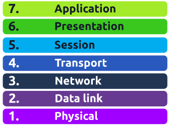
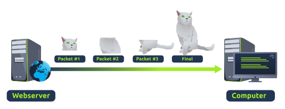
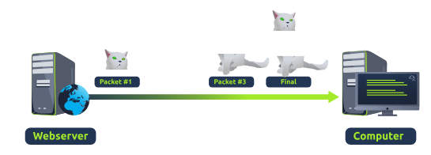

OSI Model
========================

The OSI model is an absolute fundamental model used in networking. This critical model provides a framework dictating how all networked devices will send, receive and interpret data.

OSI model consists of 7 layers. At every individual layer that data travels through, specific processes take place, and pieces of information are added to this data. This process is called encapsulation.

## Layer 7 - Application 
Layer in which protocols and rules are in place to determine how the user should interact with data sent or received.

## Layer 6 - Presentation
layer in which standardisation starts to take place. Because software developers can develop any software such as an email client differently, the data still needs to be handled in the same way - no matter how the software works.

This layer acts as a translator for data to and from the application layer. The receiving computer will also understand data sent to a computer in one format destined for in another format.

Security features such as data encryption occur at this layer (HTTPS)

## Layer 5 - Session
Once data has been correctly translated or formatted from the presentation layer, the session layer will begin to create a connection to other computer that the data is destined for.
When a connection is established, a session is created, whilst this connection is active, so is the session

This layer sync's two computers to ensure that they are on the same page before data is sent or received. 
Once these checks are in place, the session layer will begin to divide up the data sent into smaller chunks of data and begin to send these chunks one at a time.

This dividing up is beneficial because if the connection is lost, only the chunks that weren't yet sent will have to be sent again — not the entire piece of the data

What is worthy of noting is that sessions are unique — meaning that data cannot travel over different sessions, but in fact, only across each session instead.

## Layer 4 - Transport
When data is sent between devices, it follows one of two different protocols that are decided based upon several factors
1. TCP
2. UDP

### TCP
This protocol reserves a constant connection between the two devices for the amount of time it takes for the data to be sent or received
TCP also incorporates error checking into its design. Error checking is how TCP can guarantee that data sent from the small chunks in the session layer has then been received and reassembled in the same order

|Advantages of TCP  | Disadvantages of TCP |
| - | - |
| Guarantees the accuracy of data. | Requires a reliable connection between the two devices. If one small chunk of data is not received, then the entire chunk of data cannot be used. |
| Capable of synchronising two devices to prevent each other from being flooded with data. | A slow connection can bottleneck another device as the connection will be reserved on the receiving computer the whole time. |
| Performs a lot more processes for reliability. | TCP is significantly slower than UDP because more work has to be done by the devices using this protocol. |

### UDP
It doesnt boast the many features offered by TCP, such as error checking and reliability.
Any data that gets via UDP is sent to the computer whether it gets there or not. There is no synchronisation between the two devices or guarantee.

| Advantages of UDP	| Disadvantages of UDP |
| - | - |
|UDP is much faster than TCP. | UDP doesn't care if the data is received. |
| UDP leaves the application layer (user software) to decide if there is any control over how quickly packets are sent. | It is quite flexible to software developers in this sense. |
| UDP does not reserve a continuous connection on a device as TCP does. | This means that unstable connections result in a terrible experience for the user. |

## Layer 3 - Network
This layer is where the magic of routing and re-assembly of data takes place.

The factors that decide what route is taken is decided by the following:
1. What path is shorted? has least amount of devices that the packet needs to travel across
2. What path is most reliable? have packets been lost on this path before
3. Which path has faster physical connection? is one path using a copper connection or a fiber connection?

At this layer, everything is dealt with via IP addresses such as 192.168.1.100. Devices such as routers capable of delivering packets using IP addresses are known as Layer 3 devices — because they are capable of working at the third layer of the OSI model.

## Layer 2 - Data Link
layer focuses on the physical addressing of the transmission. It receives a packet from the network layer and adds in the MAC address of the receiving endpoint.

Its the job of data link layer to present the data in a format suitable for transmission

## Layer 1 - Physical
This layer references the physical components of the hardware used in networking. Devices use electrical signal to transfer data between each other in a binary system